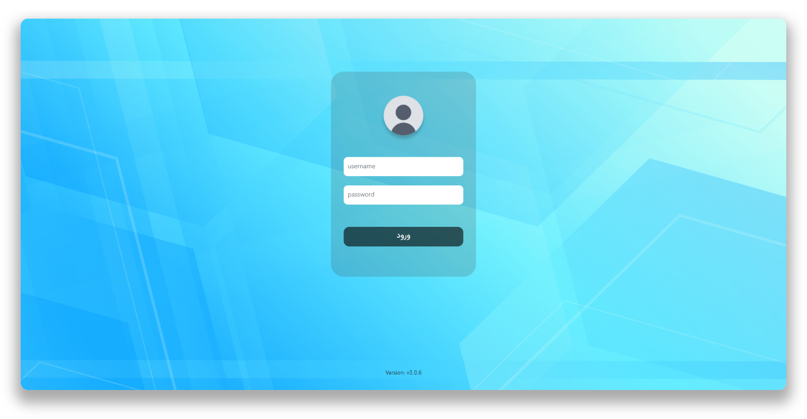
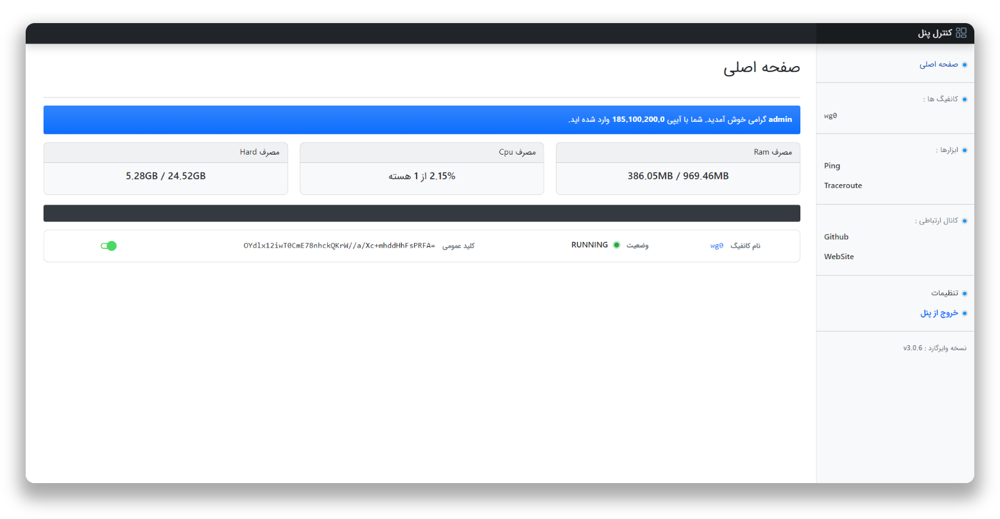
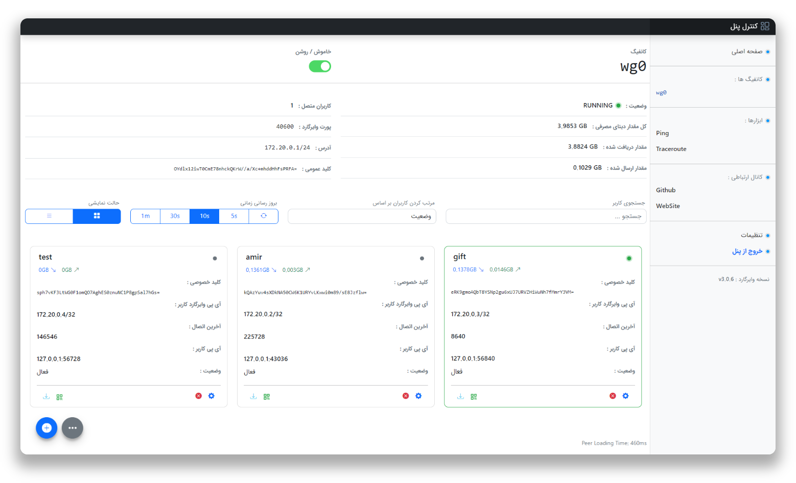
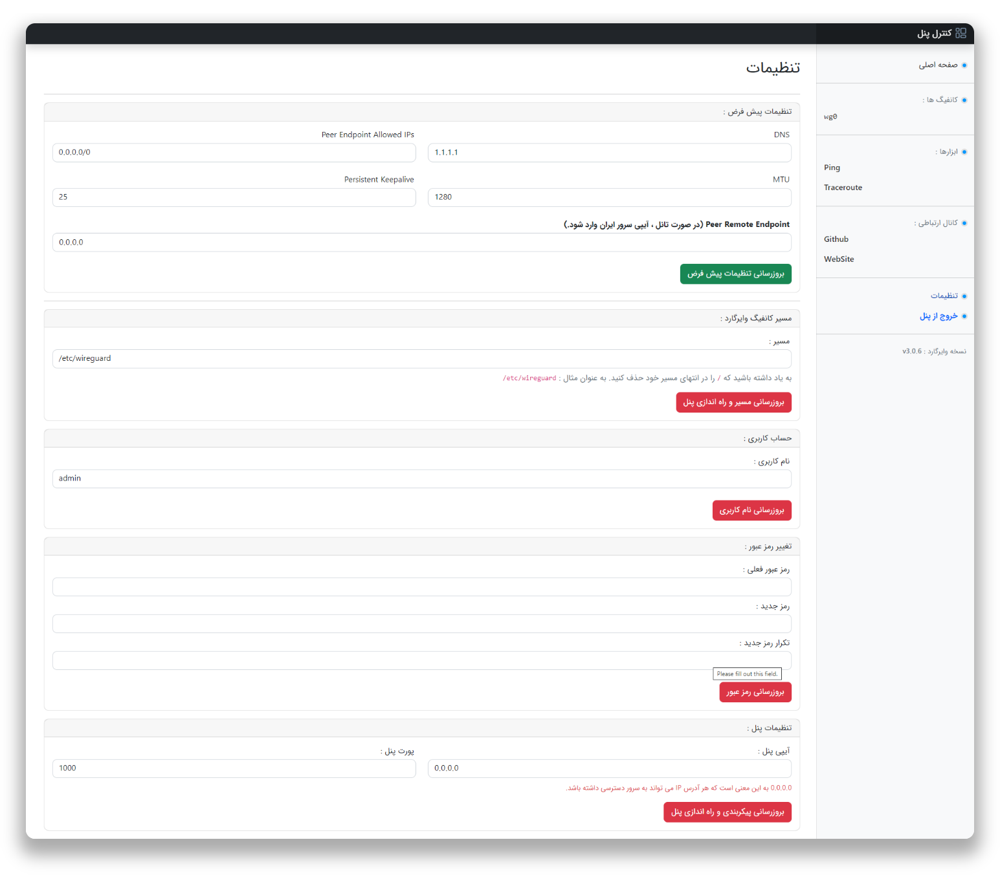

# WireGuard Dashboard
مانیتورینگ WireGuard راحت نیست، باید وارد سرور شوید و wg show را تایپ کنید<br>

به همین دلیل من این پلتفرم را برای مشاهده تمام تنظیمات و مدیریت آنها به روشی ساده تر ایجاد کردم
<br>
<br>

## Install Manually


 - سرور را اپدیت کنید و وایرگارد را نصب کنید

 
```
apt update -y
apt install wireguard -y
```

 
 - با دستور زیر پرایوت کی بسازید و در یک جا یادداشتش کنید
 
 

 
```
wg genkey | sudo tee /etc/wireguard/server_private.key
```


- دریافت اینترفیس default، عبارت بعد از dev میشه اسم اینترفیس شما (مثل eth0)

 
```
ip route list default
```


- با دستور زیر وارد مسیر کانفیگ وایرگارد بشوید

 
```
nano /etc/wireguard/wg0.conf
```


- داخلش متن زیر را کپی کنید

  
```
[Interface]
Address = 172.20.0.1/24
PostUp = iptables -I INPUT -p udp --dport 40600 -j ACCEPT
PostUp = iptables -I FORWARD -i eth0 -o wg0 -j ACCEPT
PostUp = iptables -I FORWARD -i wg0 -j ACCEPT
PostUp = iptables -t nat -A POSTROUTING -o eth0 -j MASQUERADE
PostUp = ip6tables -I FORWARD -i wg0 -j ACCEPT
PostUp = ip6tables -t nat -A POSTROUTING -o eth0 -j MASQUERADE
PostDown = iptables -D INPUT -p udp --dport 40600 -j ACCEPT
PostDown = iptables -D FORWARD -i eth0 -o wg0 -j ACCEPT
PostDown = iptables -D FORWARD -i wg0 -j ACCEPT
PostDown = iptables -t nat -D POSTROUTING -o eth0 -j MASQUERADE
PostDown = ip6tables -D FORWARD -i wg0 -j ACCEPT
PostDown = ip6tables -t nat -D POSTROUTING -o eth0 -j MASQUERADE
ListenPort = 40600
PrivateKey = YOUR_GENERATED_PRIVATE_KEY
SaveConfig = true
```


- پورت وایرگارد در اینجا 40600 است، میتوانید پورت دیگری انتخاب کنید
- دقت کنید برای سرور های دیجیتال اوشن،  از پرایوت ایپی دیگری استفاده نمایید
- پرایوت کی که ساخته بودید را به جای YOUR_GENERATED_PRIVATE_KEY قرار دهید
- در اینجا نام اینترفیس را به صورت پیش فرض eth0 قرار دادیم، اگر اینترفیس شما متفاوت است دستور بالا را ادیت کنید
- برای ساختن اینترفیس های بیشتر و با پورت های مختلف با همین روش بالا انجام بدید و فقط نام و پورت و ایپی رو عوض کنید

 
```
apt update
apt install git
git clone https://github.com/amirmbn/WireGuard-Dashboard.git
cd WireGuard-Dashboard
mv src /root/
cd
rm -rf WireGuard-Dashboard
apt-get -y install python3-pip
apt install gunicorn -y
cd src
sudo chmod u+x wgd.sh
pip install -r requirements.txt
sudo ./wgd.sh install
sudo chmod -R 755 /etc/wireguard
./wgd.sh start
```


- به پنل خودتون با http://Your_Server_IP:1000 وارد شوید. نام کاربری admin و رمزعبور 1234 است
- درصورت تانل، داخل تنظیمات Peer Remote Endpoint را به IP ایران تغییر دهید
- برای تنظیمات تانل سرورهای ایران و خارج به [این لینک](https://github.com/amirmbn/UDP2RAW) یا مراجعه کنید
- اگر به مشکل internal error در زمان لود پنل خوردید، سرور را یک بار ریبوت کنید و سپس دستور زیر را بزنید

 
```
cd src
./wgd.sh restart
```


### حذف کامل وایرگارد و پنل فارسی

 
```
cd
rm -rf src
rm -rf /etc/wireguard
sudo apt remove wireguard -y
```

 
 - اگر بعد از حذف، قصد نصب مجدد پنل را دارید کد ریز را قبل از نصب وارد کنید
 
 

 
```
mkdir /etc/wireguard
```

## Preview






</div>
